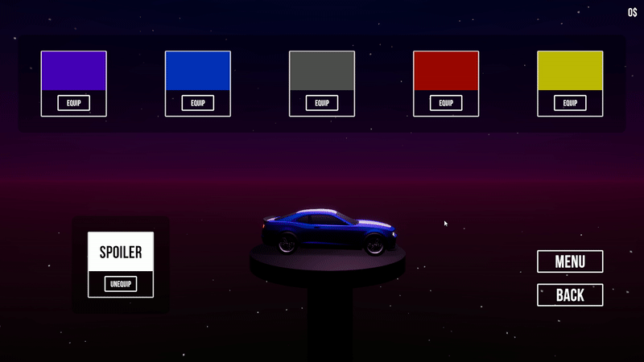

# Project Car

Poject car - проект, являющийся игрой в жанре "гонки". Игра имеет главное меню, внутриигровой магазин и 3 уровня. Интерфейс интуитивно понятен и не нуждается в особом рассмотрении.

1. Обучающий уровень, рассказывающий об основных аспектах игры.
2. Сложный уровень, включающий в себя: прыжки с трамплинов и огромную скорость. 
3. Последний уровень, включающий в себя: закрученные элементы трассы и множественные препятствия.

Для комфортного игрового опыта(60 FPS) необходимо, как минимум:
- AMD Ryzen 5 3500U | Intel Core i5-8265U
- 4 GB RAM
- AMD Radeon HD 7850 | NVIDIA GeForce GTX 750

## Игровой процесс

Геймплей игры строится вокруг многократного прохождения уровней, тем самым инкрементируя счетчик завершенных кругов. Падения с трассы инкрементируют счетчик падений.

- За каждые 10 завершенных кругов игрок получает 10 коинов(внутриигровая валюта в виде корон) и сбрасывает оба счетчика.
- За каждое падение игрок получает штраф в размере кол-ва падений в квадрате(отнимается некоторое кол-во внутриигровой валюты), 10 падений также сбрасывает оба счетчика.
- На уровнях расположены различные объекты, которые способствуют/препятствуют прохождению уровня. 

Управление:
- `W` `A` `S` `D` - управление движением автомобиля.
- `SPACE` - ручной тормоз.
- `ESC` - меню паузы.

## Магазин

На уровнях расположены коины.  
Коины - внутриигровая валюта для покупки расцветок автомобиля. Каждый подобранный коин - это +1$.

- Любая расцветка стоит 35$.
- Спойлер на автомобиль можно экипировать/снять бесплатно.

Из магазина можно попасть в меню и обратно на уровень, из которого был произведен вход в магазин.

## Меню

В меню можно управлять автомобилем.

- С помощью кнопки `PLAY`, можно попасть на экран выбора уровня.
- Кнопка `STORE` открывает магазин.
- `EXIT` - выход.

## Ассеты

- [Modular Lowpoly Track Roads FREE](https://assetstore.unity.com/packages/3d/environments/roadways/modular-lowpoly-track-roads-free-205188)
- [ARCADE: FREE Racing Car](https://assetstore.unity.com/packages/3d/vehicles/land/arcade-free-racing-car-161085)
- [Simple Street Props](https://assetstore.unity.com/packages/3d/props/simple-street-props-194706)
